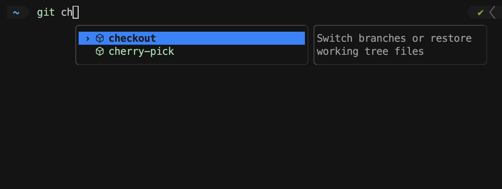
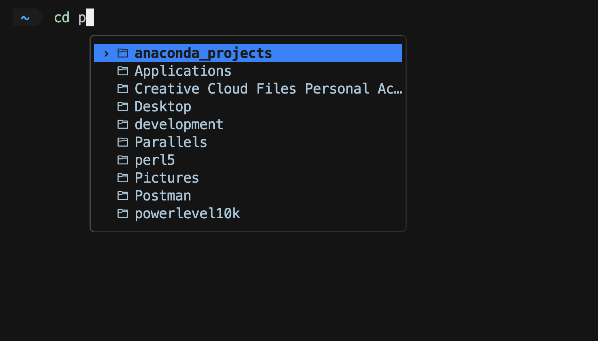
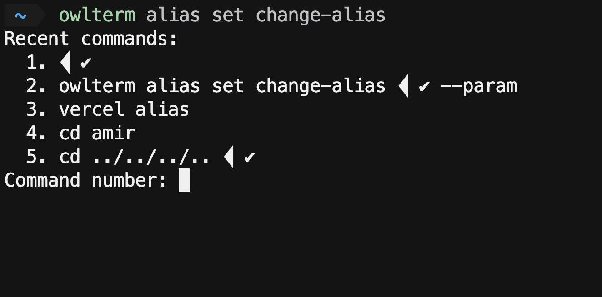

# owlterm


IDE-style dropdown autocomplete in the terminal — the Amazon Q autocomplete
experience, self-hosted — tuned for JS / React Native / iOS / Android tooling.

Type `xcodebuild -scheme` and get your project's **real** schemes. Type `adb -s`
and get your **actually connected** devices. Suggestions are ranked by what you
actually run, in the directory you're in.



Built on a fork of [`microsoft/inshellisense`](https://github.com/microsoft/inshellisense)
(MIT).

---

## Install

**Requirements:** Node `>=18 <23`, git, macOS/Linux/Windows.

```sh
curl -fsSL https://raw.githubusercontent.com/AmirSalahY/owlterm/main/install.sh | bash
```

Then start a session:

```sh
owlterm
```

Type `git ch`, `yarn`, or `xcodebuild -scheme` and the dropdown appears.

To start it automatically in every shell:

```sh
npm run shell-init          # zsh (default) — or: npm run shell-init bash
```

<details>
<summary>Clone it yourself instead</summary>

```sh
git clone https://github.com/AmirSalahY/owlterm.git && cd owlterm
npm install
npm run setup
```

</details>

**Uninstall:**

```sh
rm -rf ~/.inshellisense ~/.config/inshellisense ~/.local/bin/owlterm
rm -rf ~/.owlterm        # only if you installed via install.sh
```

---

## 🎹 Keys

| Key | Action |
| --- | --- |
| <kbd>Tab</kbd> | accept the highlighted suggestion |
| <kbd>Enter</kbd> | run the command, ignoring the suggestion menu |
| <kbd>→</kbd> | accept, only with the cursor at end of line |
| <kbd>↑</kbd> / <kbd>↓</kbd> | move the selection |
| <kbd>Esc</kbd> | dismiss for the rest of the line; <kbd>Tab</kbd> reopens |
| <kbd>Alt</kbd>+<kbd>1</kbd>…<kbd>9</kbd> | accept the Nth visible suggestion |
| <kbd>Alt</kbd>+<kbd>i</kbd> | insert the prefix common to every suggestion |
| <kbd>Alt</kbd>+<kbd>Enter</kbd> | accept **and run**, in one keystroke |
| <kbd>Alt</kbd>+<kbd>d</kbd> | show/hide the description panel |
| <kbd>Alt</kbd>+<kbd>l</kbd> / <kbd>Alt</kbd>+<kbd>s</kbd> | show more / fewer suggestions |

Run `owlterm --help` for this table in the terminal.

---

## 🎨 Theming

Rows are tinted by kind — folders, files, subcommands, options and args each
get their own color — and icons come from Codicons, plain Unicode, or emoji,
picked automatically for what your terminal can render.



```toml
# ~/.config/inshellisense/rc.toml
[theme]
icons = "auto"        # "auto" | "codicon" | "unicode" | "emoji" | "none"
colorByType = true     # tint each row by what it is
surface = "clear"      # "clear" (glass, shows your terminal's blur) or a hex fill
```

`owlterm doctor` prints the resolved icon/color style with a sample row.

---

## 🧠 Frecency-ranked suggestions

Suggestions are sorted by how often **and** how recently you've run them, with
a 4x boost for hits in your current directory. Configurable:

```toml
sortMethod = "frecency"   # frecency | recency | alphabetical | lastUsed | none
```

---

## 🔗 Parameterized command aliases

Save a whole command line, mark specific words as parameters, and get prompted
for just those values on reuse.

```sh
owlterm alias set change-alias
```

With no command after the alias name, it shows your last 5 commands to pick
from, then walks you through naming parameters:



```sh
# non-interactive form
owlterm alias set change-alias -p 5=first-url -- vercel alias set https://****.vercel.app test.com --scope myteam
eval "$(owlterm alias init)"     # enable the generated shell functions
change-alias https://new.example.app
```

---

## ⌨️ Your shell's own aliases

Aliases and functions you already have are read at session start and completed
like any other command — no config needed. If one doesn't show up, run
`owlterm reinit` to see what each shell actually exposed.

---

## Updates

```sh
owlterm update
```

Interactive sessions print a notice when a newer release is available.

---

For engine internals, spec authoring, and the release process, see
[docs/INTERNALS.md](docs/INTERNALS.md).
